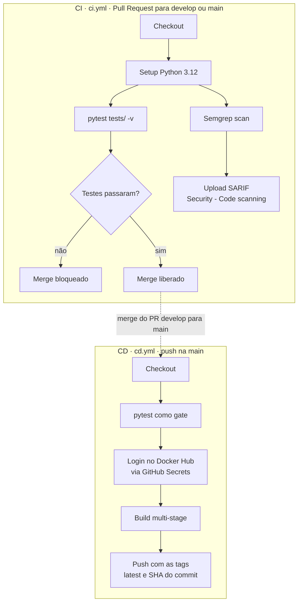

# CloudOps API

API REST em Python (FastAPI) com pipeline completo de CI/CD em GitHub Actions:
testes automatizados, análise estática de segurança (SAST), build de imagem Docker
e publicação no Docker Hub — orquestrado sobre o fluxo **GitFlow**.

## Endpoints

| Método | Rota      | Resposta                                                     |
| ------ | --------- | ------------------------------------------------------------ |
| `GET`  | `/`       | `{"mensagem": "...", "status": "online", "versao": "1.0.0"}` |
| `GET`  | `/health` | `{"status": "healthy"}`                                      |

Com a API no ar, a documentação interativa gerada pelo FastAPI fica em
<http://localhost:8000/docs>.

## Stack

| Camada    | Ferramenta                                           |
| --------- | ---------------------------------------------------- |
| API       | FastAPI 0.115 + Uvicorn                              |
| Testes    | pytest 8.3 + `TestClient` (httpx)                    |
| SAST      | Semgrep (`p/python`, `p/security-audit`, `p/secrets`) |
| Container | Docker multi-stage sobre `python:3.12-slim`          |
| CI/CD     | GitHub Actions                                       |
| Registry  | Docker Hub                                           |

---

## Executar localmente

Requisitos: Python 3.12+

```bash
python -m venv .venv
source .venv/bin/activate

pip install -r requirements.txt

uvicorn app.main:app --host 0.0.0.0 --port 8000
```

No Windows com Git Bash, a ativação é `source .venv/Scripts/activate`.

Conferindo os endpoints:

```bash
curl -s http://localhost:8000/
curl -s http://localhost:8000/health
```

## Executar os testes

```bash
pytest tests/ -v
```

Quatro testes validam status code e conteúdo da resposta dos dois endpoints.

## Executar via Docker

```bash
docker build -t cloudops-api:local .
docker run --rm -p 8000:8000 cloudops-api:local
```

Ou puxando a imagem publicada pelo pipeline:

```bash
docker pull drezix/cloudops-api:latest
docker run --rm -p 8000:8000 drezix/cloudops-api:latest
```

A imagem é multi-stage: o primeiro estágio instala as dependências num virtualenv,
o segundo copia apenas o resultado pronto — o cache do pip e as ferramentas de build
ficam para trás. O container roda como usuário sem privilégios (`appuser`, uid 1000).

---

## Pipeline



### CI — `.github/workflows/ci.yml`

Dispara em **Pull Requests direcionados a `develop` ou `main`**, em dois jobs paralelos:

| Job                         | O que faz                                                                 | Bloqueia o merge?                       |
| --------------------------- | ------------------------------------------------------------------------- | --------------------------------------- |
| `Testes unitarios (pytest)` | Instala as dependências e roda a suíte                                     | **Sim** — `pytest` com exit code ≠ 0 reprova |
| `SAST (Semgrep)`            | Analisa o código com 3 rulesets e publica o SARIF em *Security → Code scanning* | Não — `continue-on-error: true`         |

A assimetria é intencional: teste quebrado barra o merge, finding de segurança fica
visível mas não trava a entrega.

### CD — `.github/workflows/cd.yml`

Dispara em **`push` na `main`** — que na prática é o merge do Pull Request
`develop → main`. Roda a suíte novamente como portão (`needs:`) e só então publica
a imagem, com duas tags:

- **`latest`** — sempre a versão mais recente
- **`<SHA do commit>`** — imutável, permite rastrear qual commit gerou cada imagem
  e voltar atrás quando necessário

---

## GitFlow

```
main ────●──────────────────────────────────────────●──►  produção (protegida)
                                                    ▲
                                                    │ PR
develop ──●──┬─────┬─────┬─────┬─────┬──────────────┘      integração
             │     │     │     │     │
             │     │     │     │     └── feature/docker
             │     │     │     └──────── feature/ci-cd
             │     │     └────────────── feature/tests
             │     └──────────────────── feature/app
             └────────────────────────── chore/requirements
```

| Branch      | Papel                                                          |
| ----------- | -------------------------------------------------------------- |
| `main`      | Código de produção. Protegida: exige Pull Request e CI verde     |
| `develop`   | Integração das features                                          |
| `feature/*` | Desenvolvimento de funcionalidades                               |

A `main` tem branch protection ativa: push direto é rejeitado e o botão de merge
só libera com o check `Testes unitarios (pytest)` aprovado.

---

## Secrets

Configurados em *Settings → Secrets and variables → Actions*. Nenhuma credencial
existe no código ou nos logs — o GitHub Actions mascara os valores automaticamente.

| Secret               | Conteúdo                                           |
| -------------------- | -------------------------------------------------- |
| `DOCKERHUB_USERNAME` | Usuário do Docker Hub                              |
| `DOCKERHUB_TOKEN`    | Personal Access Token com permissão *Read & Write* |

## Estrutura

```
.
├── .github/
│   └── workflows/
│       ├── ci.yml            Testes + SAST (Pull Requests)
│       └── cd.yml            Build + Push Docker (merge na main)
├── app/
│   ├── __init__.py
│   └── main.py               Código da API
├── tests/
│   └── test_main.py          Testes unitários
├── Dockerfile                Build multi-stage
├── .dockerignore
├── requirements.txt
└── README.md
```
